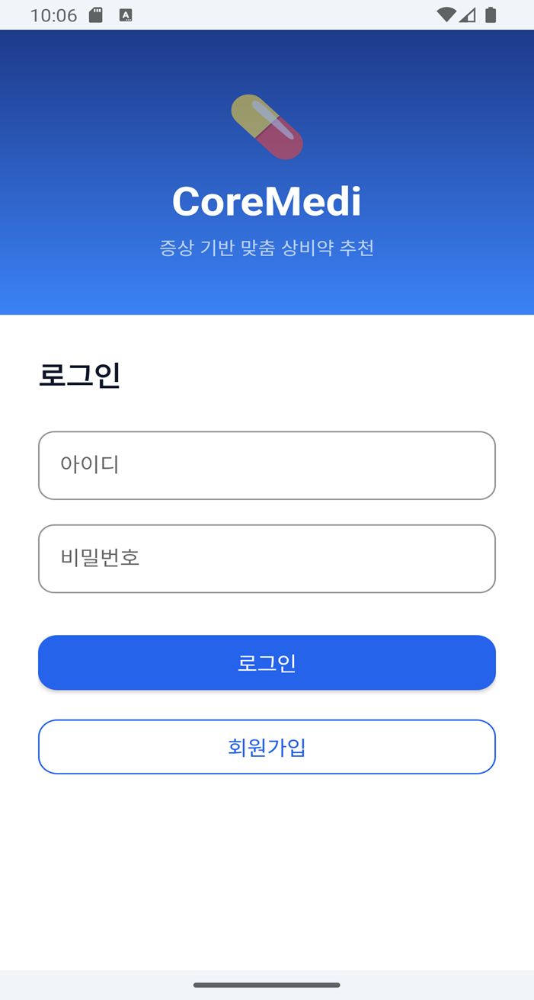
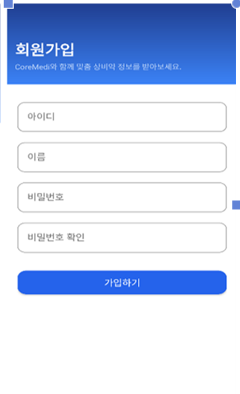
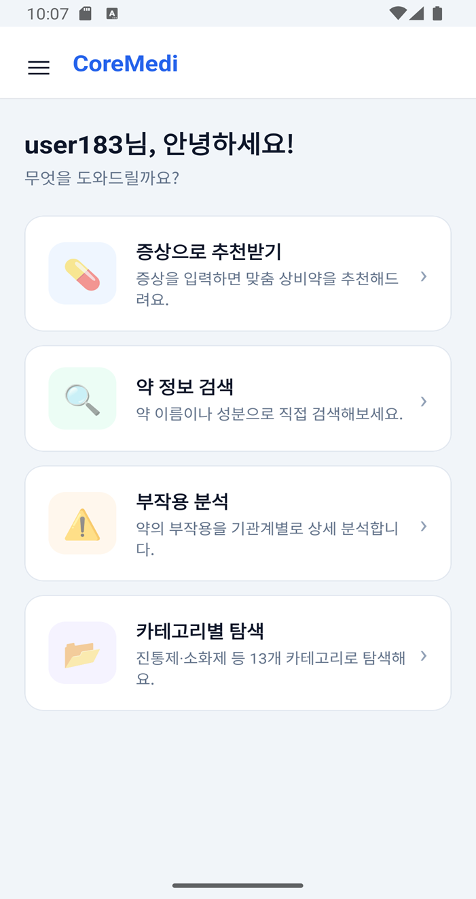
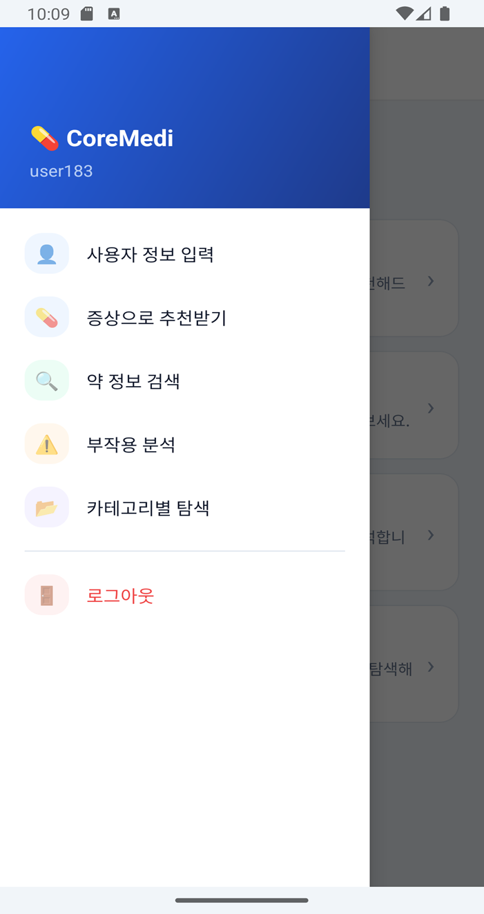
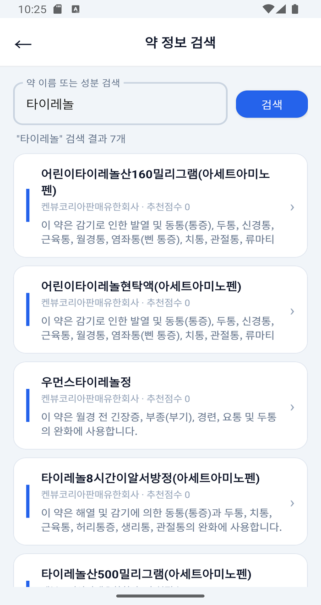
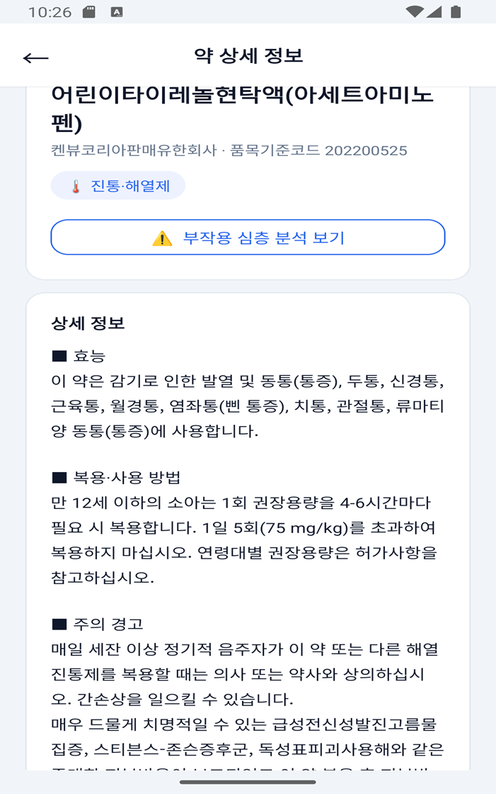
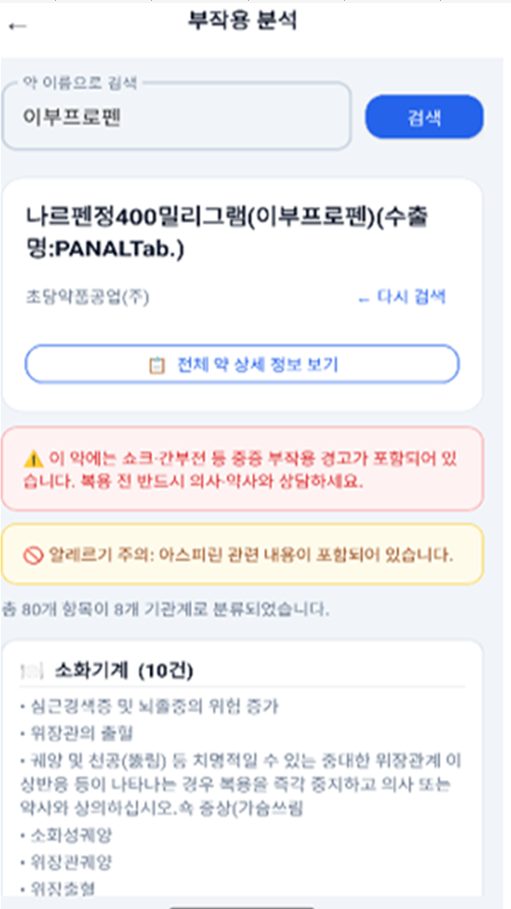
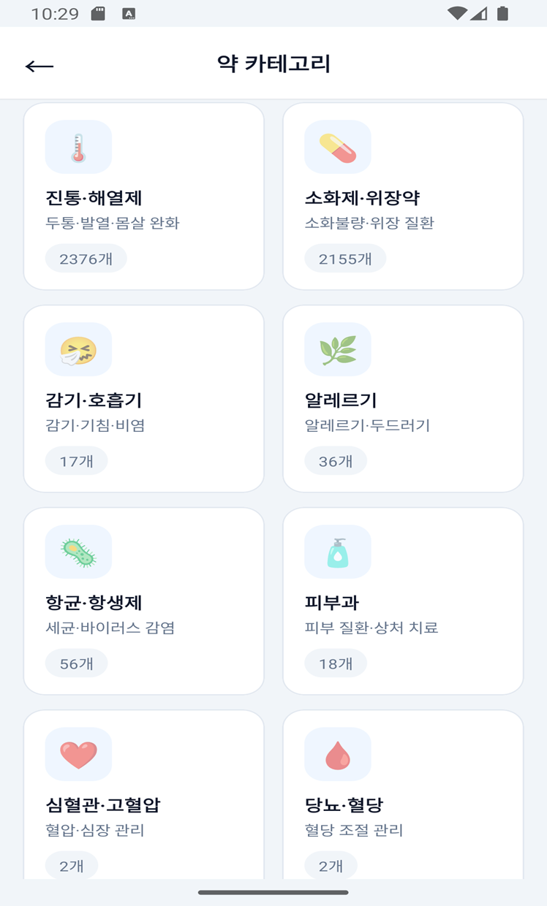

<div align="center">


# CoreMedi
### 증상 기반 맞춤 상비약 추천 안드로이드 앱

[](https://developer.android.com)
[](https://kotlinlang.org)
[](https://developer.android.com/about/versions/nougat)
[](LICENSE)

</div>

---

## 📱 스크린샷

<div align="center">

| 로그인 | 회원가입 | 메인 화면 | 사이드 메뉴 |
|:---:|:---:|:---:|:---:|
|  |  |  |  |

| 약 정보 검색 | 약 상세 정보 | 부작용 분석 | 약 카테고리 |
|:---:|:---:|:---:|:---:|
|  |  |  |  |

</div>

---

## ✨ 주요 기능

- 🔍 **증상 기반 추천** — 증상 키워드를 입력하면 관련 상비약을 관련도 순으로 최대 30개 추천
- 💊 **약 정보 검색** — 약품명 또는 성분명으로 직접 검색, 효능·복용법·부작용 전체 정보 제공
- ⚠️ **부작용 심층 분석** — 약품의 부작용을 소화기계·신경계 등 기관계별로 분류하여 표시
- 📂 **카테고리별 탐색** — 진통해열제, 소화제 등 13개 카테고리로 약품 전체 탐색
- 🚫 **알레르기 안전 필터** — 사용자 알레르기·부작용 이력 등록 시 해당 성분 약품 자동 제외
- 📴 **완전한 오프라인 동작** — 서버·인터넷 연결 없이 앱 내장 데이터만으로 모든 기능 사용 가능

---

## 🛠 기술 스택

| 분류 | 기술 |
|------|------|
| 언어 | Kotlin 2.0.21 |
| UI | Material Components 1.12.0, View Binding |
| 비동기 | Kotlin Coroutines 1.7.3 |
| 로컬 DB | Room Database 2.6.1 (SQLite) |
| 리스트 | RecyclerView + ListAdapter + DiffUtil |
| 보안 | SHA-256 + Salt (비밀번호 해시) |
| 세션 | SharedPreferences |
| 빌드 | Gradle KTS, AGP 8.7.3, KAPT |
| 데이터 | 식약처 공공 데이터 CSV (약 11,000건) |

---

## 🏗 아키텍처

3-계층(Layered) 구조를 채택하였습니다.

```
com.example.coremedi/
├── ui/            # Presentation Layer — Activity 4종, MedicineAdapter
│   ├── LoginActivity.kt
│   ├── RegisterActivity.kt
│   ├── MainActivity.kt
│   └── MedicineDetailActivity.kt
├── repository/    # Business Logic Layer
│   ├── MedicineRepository.kt   # CSV 파싱 + 추천 알고리즘
│   └── AuthRepository.kt       # 사용자 인증
├── data/          # Data Layer — Room DB
│   ├── AppDatabase.kt
│   ├── UserDao.kt
│   └── UserEntity.kt
├── model/
│   └── Medicine.kt             # Parcelable 데이터 모델
├── util/
│   ├── PasswordUtil.kt         # SHA-256 + Salt
│   └── SessionManager.kt       # SharedPreferences 세션
└── adapter/
    └── MedicineAdapter.kt
```

### 추천 알고리즘 스코어링

| 매칭 필드 | 가중치 |
|-----------|--------|
| 효능·효과 (efcyQesitm) | +10 |
| 약품명 (itemName) | +4 |
| 복용 방법 (useMethodQesitm) | +1 |

score > 0인 약품만 결과에 포함하며, 알레르기 필터링 후 내림차순 상위 30개 반환

---

## ⚙️ 개발 환경

| 항목 | 버전 |
|------|------|
| IDE | Android Studio Ladybug 이상 |
| JDK | 17 |
| AGP | 8.7.3 |
| compileSdk | 35 |
| minSdk | 24 |
| targetSdk | 35 |

---

## 🚀 빌드 및 실행

### 사전 요구사항
- Android Studio Ladybug 이상
- JDK 17
- Android 7.0+ 기기 또는 에뮬레이터 (API 24+)

### 실행 방법

```bash
# 1. 저장소 클론
git clone https://github.com/knu3146/KY_SW_coremedi.git

# 2. Android Studio에서 프로젝트 열기
#    File > Open > CoreMediApp 폴더 선택

# 3. Gradle 동기화 완료 후 실행
#    Run > Run 'app' (Shift+F10)
```

### Run Configuration 확인
`Run > Edit Configurations > app` 에서 **Module**이 `CoreMediApp.app` 으로 설정되어 있는지 확인하세요.

---

## 📂 프로젝트 구조

```
CoreMediApp/
├── app/
│   ├── src/main/
│   │   ├── assets/
│   │   │   └── coremedi.csv          # 약품 데이터 (식약처 공공 데이터)
│   │   ├── java/com/example/coremedi/
│   │   └── res/
│   │       ├── layout/               # Activity XML 4종
│   │       └── values/
│   │           ├── colors.xml
│   │           └── themes.xml
│   └── build.gradle.kts
├── gradle.properties                 # android.useAndroidX=true
└── README.md
```

---

## 🗄 데이터베이스 스키마

### users 테이블 (Room Database)

| 컬럼 | 타입 | 설명 |
|------|------|------|
| id | INTEGER PK | 자동 증가 |
| email | TEXT UNIQUE | 로그인 아이디 |
| passwordHash | TEXT | SHA-256 해시 |
| salt | TEXT | 비밀번호 해싱용 Salt |
| allergyInfo | TEXT | 알레르기 정보 (자유 텍스트) |
| sideEffectInfo | TEXT | 부작용 이력 (자유 텍스트) |

---

## ⚠️ 면책 조항

본 앱은 **일반의약품(OTC) 정보 제공**을 목적으로 하며, **의학적 진단 또는 처방을 대체하지 않습니다.**
심각한 증상이 있는 경우 반드시 의사 또는 약사에게 상담하시기 바랍니다.

---

## 👥 팀 정보

창의설계 2조

---

<div align="center">
  <sub>© 2025 CoreMedi. Built with ❤️ using Kotlin & Android</sub>
</div>
